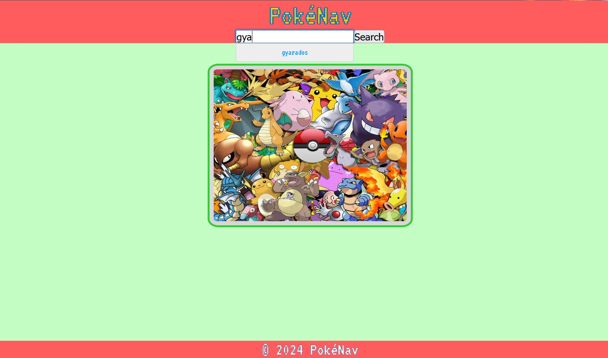
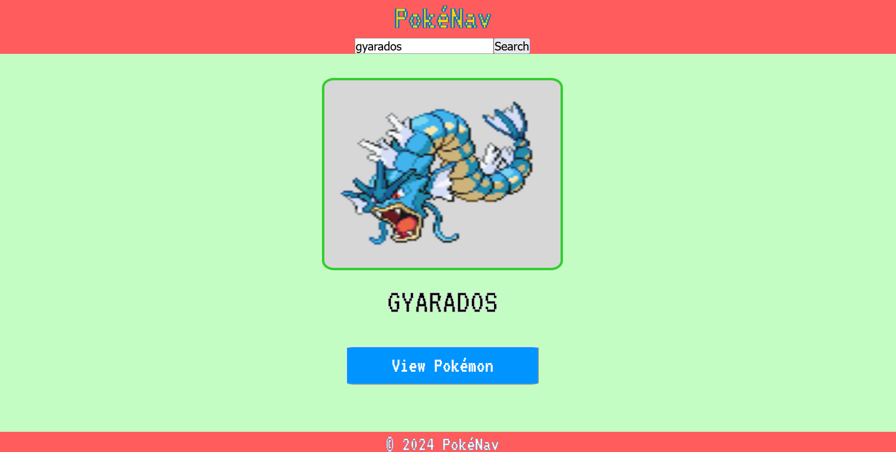
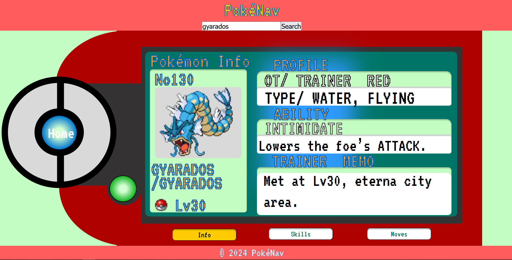
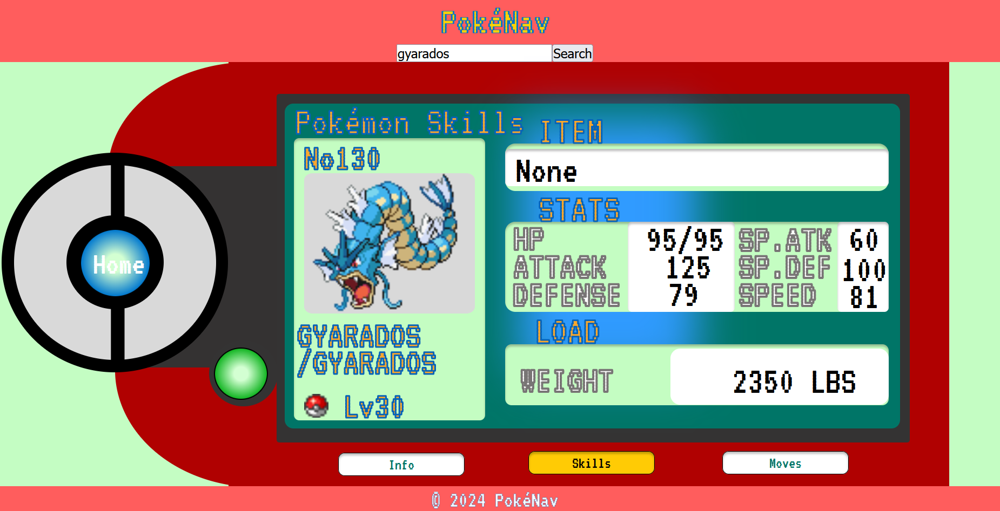
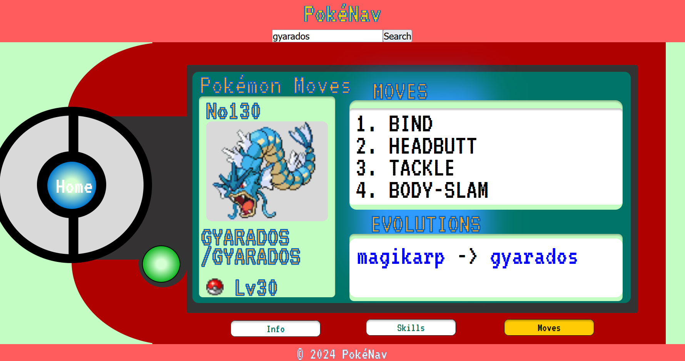

# Pokenav App 🕹️

Pokenav is an interactive web application that allows users to explore the world of Pokémon. With an intuitive search bar, detailed profiles, and an evolution display, users can easily navigate through their favorite Pokémon and discover new ones.

---

## **Table of Contents** 📋

1. [Overview](#overview)
2. [Features](#features)
   - [Search Bar with Autocomplete](#search-bar-with-autocomplete)
   - [Pokémon Profile](#pokémon-profile)
   - [Navigation](#navigation)
3. [How to Use](#how-to-use)
4. [Screenshots Overview 🖼](#screenshots-overview-)
5. [Tech Stack 🛠](#tech-stack-)
6. [How to Run the App 🚀](#how-to-run-the-app-)

---

## **Overview**
This application provides an interactive way to search for Pokémon, view detailed profiles, and explore their evolutions. It features an autocomplete search bar, clickable profiles, and intuitive navigation, making it a seamless experience for Pokémon fans.

---

## **Features**

### **Search Bar with Autocomplete**
- Begin typing a Pokémon's name in the search bar to see a list of suggestions.
- Helps quickly locate Pokémon without needing the exact spelling.

### **Pokémon Profile**
- Each profile includes:
  - **Image and Name**
  - **Navigation Bar** for Info, Skills, and Moves:
    - **Info:** Displays general information.
    - **Skills:** Lists the Pokémon's abilities.
    - **Moves:** Shows moves and evolution details.
- Clicking on any evolution will navigate to that Pokémon's profile.

### **Navigation**
- The app logo and home icon in the header return users to the home page.
- Profiles include a search bar to quickly navigate to other Pokémon profiles.

---

## **How to Use**

1. **Starting the Search**:
   - Enter the name of the Pokémon into the search bar on the home page.
   - Use the autocomplete feature for suggestions.

2. **Viewing a Pokémon's Profile**:
   - Select a Pokémon from the autocomplete suggestions or hit the "Search" button to load its profile page.

3. **Exploring the Profile**:
   - Use the navigation buttons (Info, Skills, Moves) to explore different sections of the profile.

4. **Exploring Evolutions**:
   - On the Moves page, view the Pokémon's evolutions.
   - Click on any evolution to navigate to that Pokémon's detailed profile.

5. **Navigating the App**:
   - Use the app logo or the home icon to return to the home page.
   - Use the search bar within profiles to navigate to other Pokémon profiles.

---

## **Screenshots Overview 🖼**

### **Home Page**

### **Search View**

### **Search Result**

### **Pokémon Info**

### **Pokémon Skills**

### **Pokémon Moves**

---

## **Tech Stack 🛠**
- **Frontend:** React (Create React App)
- **API:** [PokeAPI](https://pokeapi.co)

---

## **How to Run the App 🚀**

1. Clone the repository:
- git clone https://github.com/obrito00/PokemonApp
- cd PokemonApp

2. Install dependencies:
npm install

3. Start the App:
npm start